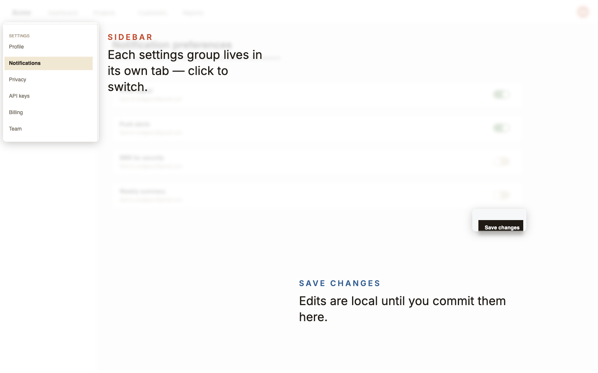

# Spotlight — Screenshot Annotator

A small web app for producing **annotated screenshots** to drop inline into
GitHub READMEs and other markdown contexts.

The output is a single flattened PNG: unaltered regions of the original
screenshot (each a "focus" lens) sit crisp and slightly raised on top of a
lightened, softly-blurred copy of the same screenshot, with short headline +
body text floating on the blurred surface.



Live at **<https://dudgeon.org/screenshot-annotator/>**.

## Run it locally

```sh
npm install
npm run dev          # http://localhost:5173
```

Or build a static bundle:

```sh
npm run build
npm run preview
```

## Use it

1. Drop a screenshot onto the upload zone (PNG / JPEG, any size).
2. Drag the focus rect, resize it from a corner, click the headline or body
   to edit inline. Add more callouts from the right panel — each gets its
   own focus + headline + body.
3. Tweak blur / lightness / tint / shadow / magnification from the right
   panel.
4. Hit **Export PNG** to download, or **Copy** to put the PNG on your
   clipboard and paste straight into a GitHub comment.

State and the loaded screenshot persist to `localStorage`, so a refresh
restores your work.

### Keyboard shortcuts

| | |
|--|--|
| `⌘Z` / `⌃Z` | Undo |
| `⌘⇧Z` / `⌃⇧Z` / `⌃Y` | Redo |
| `←` `→` `↑` `↓` | Nudge selected callout 1% |
| `⇧` + arrow | Nudge 5% |
| `Esc` | Deselect |
| `Delete` / `Backspace` | Delete selected callout |

Embed the result in a README:

```markdown

```
